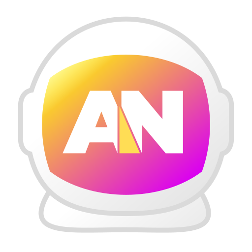

# Agentonaut

<p align="center">
  
</p>

A containerized, isolated environment for AI CLI agents (Claude Code, Gemini CLI) using Podman and Nushell, with built-in optional MCP server orchestration.

## Overview

Agentonaut CLI runs AI agents in isolated Podman containers, using rootless Podman to prevent access to the host system, secrets, or unrelated project files.

The orchestration layer is written in [Nushell](https://www.nushell.sh/).
Agentonaut can be customized and extended with profiles and custom local containers.

## Quick Start

### Prerequisites

Tested on Linux. The install script runs a pre-flight check before proceeding.

- Podman (v4.4.0+), configured for rootless use:
  - `/etc/subuid` and `/etc/subgid` must have entries for the user
  - `slirp4netns` or `pasta` must be installed for rootless networking
  - See [Rootless mode](https://docs.podman.io/en/latest/markdown/podman.1.html#rootless-mode) in the Podman documentation
- Nushell (v0.111.0+)
- minijinja-cli (v2.0.0+, `cargo install minijinja-cli`)
- git (v2.25.0+)

### Installation & Setup

1. **Clone and Install:**
   ```Shell
   git clone https://github.com/s3n-ops/agentonaut-cli.git ~/tools/agentonaut
   cd ~/tools/agentonaut
   ./install.nu
   ```
   The install script is idempotent. It generates the wrapper script, sets up the host environment, creates the container network, downloads upstream Containerfiles, and installs agent add-ons.

   Clone the repository into its permanent location before running the install script. The generated wrapper references this path. Moving the directory afterwards breaks the wrapper; to relocate, move the directory, delete `~/.local/bin/agentonaut`, and run `nu install.nu` again.

   *Review `~/.config/agentonaut/config.toml` to customize persistent data paths if needed. The skeleton configuration is at [`conf/config.skel.toml`](conf/config.skel.toml).*

2. **Build local container images:**
   ```Shell
   agentonaut image build by origin local
   ```

3. **Launch:**
   ```Shell
   agentonaut launch ~/projects/my-project
   ```

4. **Authenticate:**
   On first launch, each agent runs an interactive onboarding process that handles authentication. Follow the on-screen instructions.

### Next Steps

Agentonaut ships with a `minimal` profile (agent only) and a `full` profile (agent + MCP sidecars). The included sidecars provide a Nushell execution environment and an offline documentation server. Additional MCP servers can be added via custom profiles. See [Adding a Kube Profile](#adding-a-kube-profile).

To index documentation for offline use, run `agentonaut docs download <profile>` first (e.g. `agentonaut docs download nushell`). Launch with `--profile full` to start the `docs-mcp-server`, then open a second terminal and run `agentonaut docs index all`.

See [Usage](#usage) for the full command reference.

### Usage

The sections below cover the most common commands. Run `agentonaut --help` for the full list. Use `agentonaut <namespace> --help` to list subcommands.

#### Running agents

Mount a project directory and start an agent session. To resume a previous session, use `/resume` inside the agent. The session history is tied to the path; a different path switches the agent's context.

```shell
agentonaut launch ~/projects/my-project
agentonaut launch ~/projects/my-project --agent gemini
agentonaut launch ~/projects/my-project --agent claude --profile full
agentonaut launch ~/projects/my-project --add-workspace [~/projects/my-second-project,~/projects/your-project] --agent claude
```

#### Chat

For quick sessions without a project context. Each session is stored in a date-stamped directory under `chat_base_path` (default: `~/Documents/agentonaut/<agent>/<ISO-date>/`).

```shell
agentonaut chat
```

#### Abort

Stops and removes the pod and all its containers started by the last `launch` or `chat` command.

```shell
agentonaut abort
```

#### Diagnostics

`doctor` checks the loaded config file, tool versions (Nushell, Podman), image availability, and the container network. `host check` verifies that the config and data directories for a given agent exist on the host.

```shell
agentonaut doctor
agentonaut host check claude
```

#### Image management

Build and manage the Podman container images defined in the profile configuration.

```shell
agentonaut image build all
agentonaut image build claude-contrib --force-rebuild
agentonaut image cleanup dangling
```

To update an agent to a newer version, rebuild its image with `--force-rebuild`:

```shell
agentonaut image build claude --force-rebuild
agentonaut image build gemini --force-rebuild
```

The **`by`** subcommand filters profiles by a field value, available for `image build`, `image remove`, and `git download`:

```shell
agentonaut image build by origin upstream
agentonaut image remove by origin local
agentonaut git download by origin upstream
```

#### Documentation

Download official documentation repositories and index them into `docs-mcp-server` for use as offline context in agent sessions.

```shell
agentonaut docs download            # list available profiles
agentonaut docs download nushell
agentonaut docs download all        # 5 GiB+
agentonaut docs status
agentonaut docs index all           # pod must be running
agentonaut docs index status
```

### Uninstall

Stop any running pod first:

```Shell
agentonaut abort
```

Remove container images and the network:

```Shell
agentonaut image remove all
agentonaut network remove
```

Remove the wrapper script and the project directory:

```Shell
rm ~/.local/bin/agentonaut
rm -rf ~/tools/agentonaut
```

Remove configuration and application data:

```Shell
rm -rf ~/.config/agentonaut/
rm -rf ~/.local/share/agentonaut/
```

The chat directory at `~/Documents/agentonaut/` contains session notes saved by `/checkpoint`. Remove it only if you no longer need those files:

```Shell
rm -rf ~/Documents/agentonaut/
```

`agentonaut-network` is the default network name. If you changed it in `config.toml`, use the name from `agentonaut.podman.network` instead.

## Configuration

The configuration file lives at `~/.config/agentonaut/config.toml` and is generated by `agentonaut host setup`. The skeleton at [`conf/config.skel.toml`](conf/config.skel.toml) documents all available options.

### Directory Layout


| Path | Purpose |
|------|---------|
| `~/.config/agentonaut/config.toml` | Main configuration file |
| `~/.config/agentonaut/<agent>/` | Agent-specific configuration (e.g. API keys) |
| `~/.local/share/agentonaut/<agent>/` | Persistent agent data (sessions, history, plugins, skills, commands) |
| `<chat_base_path>/<date>/` | Chat session directories (path set via `chat_base_path` in the agent profile) |

Agent config and data paths are configurable via `config_path` and `data_path_host` in the agent profile.

### Profile Architecture

Profiles are nested TOML tables. Each table key becomes the profile ID.
An agent profile references one container profile. A kube profile references zero or more MCP profiles. Each MCP profile references a container profile. Agent and kube profiles are combined at launch time via `--agent` and `--profile`.

#### Flat View

```
profile.agent.*       # Agent definitions (claude, gemini)
profile.kube.*        # Pod configurations (agent + MCP sidecars)
profile.mcp.*         # MCP server definitions
profile.container.*   # Container image build definitions
profile.docs.*        # Offline documentation repositories
```

#### Tree View

```
profile.agent.*  (claude, gemini)
└── 1:1  profile.container.*  (claude, gemini)

profile.kube.*  (minimal, full, nushell, docs)
└── 0:N  profile.mcp.*  (nushell, docs-mcp-server)
         └── 1:1  profile.container.*  (mcp-nushell, ...)

profile.docs.*  (standalone: nushell, ansible, podman, ...)
```

### Adding an MCP Profile

An MCP profile defines a new MCP server sidecar. Three entries are required: a container profile, an MCP profile, and a kube profile that references it.

Add a container profile under `[profile.container.*]`:

```toml
[profile.container.my-mcp]
origin = "local"
local_dir = "container/custom/my-mcp"
containerfile = "Containerfile"
context = "."
image_tag = "localhost/my-mcp:latest"
container_name = "my-mcp"
description = "My custom MCP server"
container_args = ["--mcp"]
podman_args = []
env_vars = {}
```

Add an MCP profile under `[profile.mcp.*]`:

```toml
[profile.mcp.my-mcp]
container = "my-mcp"
yaml_file = "conf/kube/my-mcp.yaml"
name = "my-mcp"
transport = "http"
url = "http://my-mcp:8080/mcp"
```

Reference it in a kube profile:

```toml
[profile.kube.custom]
description = "Agent with my custom MCP"
mcp_profiles = ["my-mcp"]
```

Build the image and launch:

```Shell
agentonaut image build my-mcp
agentonaut launch ~/Projects/my-project --agent claude --profile custom
```

### Adding a Kube Profile

Kube profiles are agent-agnostic: they define which MCP servers run alongside any agent.
To add a custom MCP set, add a new entry under `[profile.kube.*]`:

```toml
[profile.kube.custom]
description = "Custom MCP setup"
mcp_profiles = ["nushell", "docs-mcp-server"]
```

Launch it with any agent:

```Shell
agentonaut launch ~/Projects/my-project --agent claude --profile custom
agentonaut launch ~/Projects/my-project --agent gemini --profile custom
```

### Adding a Documentation Profile

Documentation profiles define repositories to download and index with `docs-mcp-server`.
Add a new entry under `[profile.docs.*]`:

```toml
[profile.docs.my-tool]
repo = "https://github.com/example/my-tool-docs.git"
target_dir = "my-tool"
branch = "main"
depth = 1
description = "My tool documentation"
library_name = "my-tool-documentation"
mcp_url = "file:///docs/my-tool/docs"
```

`repo` is optional. For web-based documentation, omit it and use a direct URL:

```toml
[profile.docs.my-tool-web]
description = "My tool documentation (web)"
library_name = "my-tool-documentation"
mcp_url = "https://docs.example.com/my-tool"
```

Download and index:

```Shell
agentonaut docs download my-tool
agentonaut docs index my-tool
```

## Agent Add-Ons

Add-ons extend agents with slash commands, skills, and sub-agents. They are stored in `addons/<agent>/` in the project directory and installed to the agent's data directory (`~/.local/share/agentonaut/<agent>/`).

### Installation

```Shell
agentonaut agent setup claude
agentonaut agent setup gemini
```

Use `--overwrite` to update existing files after changes:

```Shell
agentonaut agent setup claude --overwrite
```

### Slash Commands

Commands are available as slash commands inside an agent session.

| Slash Command | Claude | Gemini | Description |
|---------|--------|--------|-------------|
| `/checkpoint` | yes | yes | Save session progress to a markdown file |
| `/manual <topic>` | yes | yes | Search docs-mcp-server for documentation |
| `/git:commit` | no | yes | Generate a git commit message, without running git commit |
| `/git-commit` | yes | no | Generate a git commit message, without running git commit |
| `/lang <language>` | yes | yes | Set the session language (e.g. `/lang en`, `/lang es`, `/lang fr`, `/lang de`) |
| `/nu <expression>` | yes | yes | Execute a Nushell expression via mcp-nushell |
| `/sandbox` | yes | yes | Inform the agent about its container environment and how to troubleshoot issues |

### Skills (Claude)

Skills are invoked automatically based on context, or explicitly by name.

#### docs-search
Searches docs-mcp-server for offline documentation. Activates when the question requires precise syntax, correct code examples, or discovery of unknown functionality. Requires a running `docs-mcp-server` with indexed libraries.

#### nushell-command-expert
Queries the running `mcp-nushell` server for command help and command listings.

#### nushell-operator
Executes Nushell expressions in the live `mcp-nushell` environment for testing and evaluation.

### Sub-Agents (Claude)

#### nushell
Nushell sub-agent with access to the Nushell skills above. Invoke it for writing or debugging Nushell scripts.

## Core Features

### Rootless Container Isolation

Agents are strictly confined to their designated workspace mounts (see [Security Trade-offs](#security-trade-offs)).
Workspace mounts are one or many host directories, that are mounted inside the container under `/workspace`.

### Workspace Mapping

Host paths are sanitized and mapped to unique container paths.

**Example:**

```
# Host
/home/user/projects/my-app

# Container
/workspace/home-user-projects-my-app
```

Claude Code and Gemini CLI store per-directory state under `~/.local/share/...`. Without a unique mapping, both tools would treat every session as the same project. For this reason, distinct host directories must map to unique paths inside the container.

### Agent Data Persistence

Agent data is persisted via `hostPath` volumes defined in the Kube YAML. Each agent has two mounts: one for its data directory and one for its config file.

| Host path | Container path | Contents |
|-----------|---------------|----------|
| `~/.local/share/agentonaut/claude` | `/home/claude/.claude` | Sessions, history, skills, commands |
| `~/.config/agentonaut/claude/claude.json` | `/home/claude/.claude.json` | Authentication, settings |
| `~/.local/share/agentonaut/gemini` | `/home/gemini/.gemini` | Sessions, history, plugins |
| `~/.config/agentonaut/gemini/gemini.json` | `/home/gemini/.gemini.json` | Authentication, settings |

The host paths are created on first launch (`DirectoryOrCreate`, `FileOrCreate`). Agent data like authentication and history persists across sessions, because it is stored on the host, not in the container.

### Profile Management

Configurations are managed as nested TOML tables (Cargo-style), providing hierarchical namespaces and data fetching without ID collisions.

**Example:**

```toml
[profile.agent.gemini]
container = "gemini"

[profile.agent.claude]
container = "claude"

[profile.kube.devops]
mcp_profiles = ["nushell", "docs-mcp-server"]

[profile.mcp.nushell]
container = "mcp-nushell"
url = "http://mcp-nushell:8001/mcp"
```

The TOML key becomes the profile ID (`claude`, `gemini`, `devops`). Agent profiles define the container image; kube profiles define which MCPs run alongside. The combination is chosen at launch time via `--agent` and `--profile`.

### Declarative Pod Orchestration

Multi-container setups (Agent + multiple MCP sidecars) are generated dynamically via Jinja2 templates and executed via `podman kube play`.

### MCP Support (Experimental)

MCP server support is experimental. Individual MCP servers may crash inside the container, as the MCP ecosystem is still maturing and server implementations vary in stability.

### Offline Documentation MCP

Fetches developer documentation repositories and indexes them into `docs-mcp-server` for use as offline context. The workflow is:

1. **Download** a documentation profile with `agentonaut docs download <profile>`. Run `agentonaut docs download` without arguments to list available profiles. `agentonaut docs download all` downloads every profile (5 GiB+).
2. **Launch** a session with the `devops` kube profile: `agentonaut launch ~/project --profile devops`
3. **Index** the downloaded docs into the running server: `agentonaut docs index all`
4. **Browse** the web dashboard to verify: `http://127.0.0.1:6280`

Each profile entry requires `library_name` (the name registered in the server) and `mcp_url` (the path passed to `docs-mcp-server scrape`). Run `agentonaut docs status` to see which profiles are downloaded and configured for indexing.

As an alternative to the MCP docs server, documentation directories can be mounted into the agent container via `--add-workspace`, allowing agents to search them directly on request.

## AI Security

AI agents process whatever data they are given access to and prompted to work with. Credentials, personal data, or confidential documents, once exposed to the AI agent, cannot be unexposed. What happens to them afterwards is outside your control. The following practices reduce that risk.

### Secrets

Never mount credentials, API keys, SSH keys, or files with production secrets into the agent container. Use [SOPS](https://github.com/getsops/sops) or [Ansible Vault](https://docs.ansible.com/ansible/latest/vault_guide/index.html) to encrypt secrets at rest. Pass only what the agent needs for the task at hand.

Inform the agent about its environment via `CLAUDE.md` or `GEMINI.md`. Explicitly state that secrets are intentionally absent from the container and instruct the agent to work with mock data instead. Agents generally respect this and adapt their behavior accordingly.

### Sensitive Documents

PDFs may contain embedded text, metadata, or hidden layers that are invisible on screen but readable by an agent. Before mounting a PDF into the container, create a redacted copy with [Censor](https://codeberg.org/censor/Censor) and verify the result with `pdftotext` and `pdfimages` to confirm that no sensitive content remains.

```Shell
pdftotext document.pdf document.txt
```

```Shell
mkdir -p /tmp/pdfimages/
pdfimages -all document.pdf /tmp/pdfimages/
```

### Further Reading

The [OWASP Top 10 for Large Language Model Applications](https://owasp.org/www-project-top-10-for-large-language-model-applications/) and the [OWASP GenAI Security Project](https://genai.owasp.org/) document the most critical risks when operating agentic AI systems.

## Architecture & Technology Choices

### Why Nushell?

Nushell is a scripting language that works with structured data and supports optional input/output types for commands, instead of piping raw text. Calling external binaries (`podman`, `git`, `npm`) is straightforward, and their output can be parsed and processed with ease. Nushell supports [subcommands](https://www.nushell.sh/book/custom_commands.html#subcommands) natively: a command defined as `"main image build all"` becomes the subcommand `agentonaut image build all`. This maps directly to a natural CLI hierarchy without additional parsing logic.
Nushell supports modules and submodules, which keep code organized and encourage reuse.
Its large built-in command library covers string manipulation, file system operations, HTTP requests, and more, reducing the need for external tools, like curl and jq.
Nushell strikes a balance between expressive scripting, readability, predictability and shell pragmatism.

### Why Podman?

Agentonaut uses Podman's [built-in rootless mode](https://docs.podman.io/en/latest/markdown/podman.1.html#rootless-mode). Container processes run as the invoking user, which enforces the Principle of Least Privilege.

Podman supports Kubernetes YAML natively via [`podman kube play`](https://docs.podman.io/en/latest/markdown/podman-kube-play.1.html). Pod definitions are structurally compatible with Kubernetes: the same YAML format works locally and in a cluster, though host-specific settings (such as `hostPath` volumes) require adaptation for cluster deployments.

[Pods](https://docs.podman.io/en/stable/markdown/podman-pod.1.html) group multiple containers under a shared network namespace. Agentonaut uses this to run an agent container alongside MCP sidecar containers, which communicate within the pod's shared network namespace.

### Why not Use Built-in Sandboxing?

Both Claude Code and Gemini CLI include built-in sandboxing.
Claude Code uses [bubblewrap](https://code.claude.com/docs/en/sandboxing#os-level-enforcement) on Linux.
Gemini CLI supports [container-based sandboxing](https://geminicli.com/docs/cli/sandbox/#2-container-based-dockerpodman) via Docker or Podman.

Agentonaut also uses Podman, but puts the container definition under user control:

#### Control
The container image is defined locally. You choose which tools, versions, and system configurations are available to the agent.

#### Consistency
Both agents run in a customizable container environment, with your toolset, regardless of which agent is active.

#### MCP sidecars
MCP servers run as isolated containers in the same pod as the agent container, communicating within the pod's shared network namespace.

#### Unified launcher
One command launches any agent with a matching profile. Switching between Claude Code and Gemini is a single flag, useful when quota is exhausted or a second opinion is needed.

### Configuration Loading

Nushell has no singleton pattern and no mutable global variables outside of `$env`. To make the parsed configuration available throughout the script, Agentonaut stores it under a dedicated key in `$env` on startup, using `load-env` to inject a named record:

```nushell
cfg init "agentonaut"   # Loads config.toml into $env.agentonaut.cfg
```

The key matches the application name. This prevents collisions with other tools using the same convention: a tool named `mytool` would load into `$env.mytool`, leaving `$env.agentonaut` untouched. Subcommands access configuration data directly:

```nushell
$env.agentonaut.cfg.profile   # Profile table
$env.agentonaut.cfg_idx       # Flattened dot-notation index
```

Configuration is loaded and managed exclusively by the main script. Modules under `mod/` do not access `$env.agentonaut` directly. Instead, the main script extracts the relevant data and passes it as parameters. This keeps modules decoupled from the application-specific `$env` key and reusable in other projects. The `cfg` module provides helper functions (`extract`, `unfold`, `extract query`, etc.) for querying and transforming configuration data before passing it to modules.

### Security Trade-offs

#### Seccomp

To support CLI agents, Node.js environments, and JIT compilers, the containers are run with `--security-opt seccomp=unconfined`. This trade-off is mitigated by rootless Podman and user namespace mapping (`keep-id`). The container process possesses no elevated privileges on the host system.

#### SELinux

On SELinux-enabled systems, container processes run under the `container_t` type by default. Host directories mounted into the container must carry a compatible file context (e.g. `container_file_t`) for SELinux to allow access.

All `hostPath` volume mounts use the `:z` option. Podman interprets this as an instruction to relabel the mounted host directory with the shared `container_file_t` context at pod start. The relabeling is scoped to the specific directories mounted at launch time and is a no-op on systems without SELinux active.

The `:z` option marks content as shared, which is required because multiple containers in the pod (agent and MCP sidecars) access the same workspace volumes. Per-container isolation via `:Z` would conflict across containers sharing a volume.

On systems without SELinux (e.g. most Debian and Ubuntu installations), Podman ignores the `:z` option. No relabeling occurs and no error is raised.

### Custom Container Strategy

Agentonaut uses custom [`Containerfile`](https://github.com/opencontainers/image-spec) definitions for Gemini and Claude Code instead of using official images directly. Containerfiles are the OCI-standard equivalent of Dockerfiles.

#### Independent Build for Claude

The Claude Code custom container is built directly on `debian:trixie-slim`. Claude Code is installed via the official install script, which uses Bun as its runtime. See the official https://github.com/anthropics/claude-code/blob/main/.devcontainer/Dockerfile for reference.

#### Independent Build for Gemini

An [official Dockerfile](https://github.com/google-gemini/gemini-cli/blob/main/Dockerfile) for Gemini CLI exists, based on `node:20-slim`. The custom Agentonaut image uses `node:20-trixie-slim` instead and adds a similar toolset to the Claude container. The official image is available as the `gemini-contrib` profile but is not used as a base for the custom container.

#### Unified Tooling

Customizing both environments allows Agentonaut to provide a suite of tools (Nushell, Ripgrep, Ansible, etc.) and system configurations (e.g., host-synchronized timezones) across all agents.

#### Version-Aware Builds

Container profiles that track an upstream repository (e.g., Gemini CLI, Nushell MCP) carry a `version_check` field. Before building, Agentonaut fetches the latest upstream release tag via `git ls-remote` and compares it to the version baked into the existing image. If the versions match, the build is skipped. If they differ, the image is rebuilt with the new version passed as a build argument. Use `--force-rebuild` to bypass the check.

## Testing

The `tests/` directory contains unit tests for pure module functions in `mod/`. Tests run with [nutest](https://github.com/vyadh/nutest), located in `lib/nutest/`. Install it with:

```Shell
./install.nu nutest
```

Re-run the command to update nutest to the latest version.

Only modules with pure functions are unit-testable. A function is pure if it takes data as parameters, produces a deterministic result, and has no side effects. Modules that invoke external processes (`podman`, `git`), perform file I/O, or mutate `$env` require a live system and are only suitable as integration tests.

The testable modules are:

| Module | Tested functions |
|--------|-----------------|
| `mod/util` | `sanitize path`, `sanitize name` |
| `mod/script` | `shorten text`, `clean description`, `get namespaces`, `set-nested-path`, `env override` |
| `mod/profile` | `convert-to-list`, `get-nested`, `list-names`, `list-types`, `list-by-type`, `fetch`, `filter-by-type`, `query`, `query with-repo`, `extract`, `fetch multiple` |
| `mod/cfg` | `unfold`, `extract`, `extract by`, `extract query`, `extract nested` |
| `mod/podman/kube` | `update container`, `update volumes`, `update volumes by name`, `update workspace` |

### Run all tests

```Shell
nu bin/run-tests.nu
```

### Run tests matching a name pattern

```Shell
nu bin/run-tests.nu --match-tests sanitize
```

### CI

Exit with code 1 on any failure:

```Shell
nu bin/run-tests.nu --fail
```

### Linting

[nu-lint](https://codeberg.org/wvhulle/nu-lint) is an optional development tool for static analysis of Nushell scripts. Install it with:

```Shell
cargo install nu-lint
```

Run the linter on the project:

```Shell
bin/nu-lint-project.nu
```

## Troubleshooting

### Image not known

#### Problem
```
<DATE>|ERR|Failed to start pod: Error: localhost/docs-mcp-server:latest: image not known
```

#### Solution
```Shell
agentonaut image build docs-mcp-server
```

### Error initializing source

#### Problem

```Shell
agentonaut image build docs-mcp-server
...
time="<DATE_TIME>" level=warning msg="Failed, retrying in 2s ... (1/3). Error: initializing source docker://localhost/docs-mcp-server-contrib:latest: pinging container registry localhost: Get \"https://localhost/v2/\": dial tcp [::1]:443: connect: connection refused"
...
Error: creating build container: unable to copy from source docker://localhost/docs-mcp-server-contrib:latest: initializing source docker://localhost/docs-mcp-server-contrib:latest: pinging container registry localhost: Get "https://localhost/v2/": dial tcp [::1]:443: connect: connection refused
```

#### Solution

```Shell
agentonaut image build docs-mcp-server-contrib
```

### sha256sum: no properly formatted checksum lines found

#### Problem

A container build fails with:

```
sha256sum: SHA256SUMS: no properly formatted checksum lines found
Error: building at STEP "RUN ...": while running runtime: exit status 1
```

The downloaded checksum file is nearly empty. The Containerfile calls the GitHub API internally to determine the latest release version. If the API is unreachable or rate-limited, the request fails, `jq` outputs `null`, and the resulting download URL is invalid.

This typically happens when several images are built in sequence during a fresh install.

#### Solution

Wait a few minutes, then rebuild the affected image:

```Shell
agentonaut image build gemini --force-rebuild
agentonaut image build mcp-nushell --force-rebuild
```

## AI Disclosure

Development was assisted by AI tools (Gemini, Claude, Junie).

## Contributing

I built Agentonaut as an opinionated tool for my own workflow. To keep the project focused and manageable, I am not accepting external contributions. It is provided 'as-is' under the MIT license.

## License

MIT License. See [LICENSE](LICENSE) for details.
